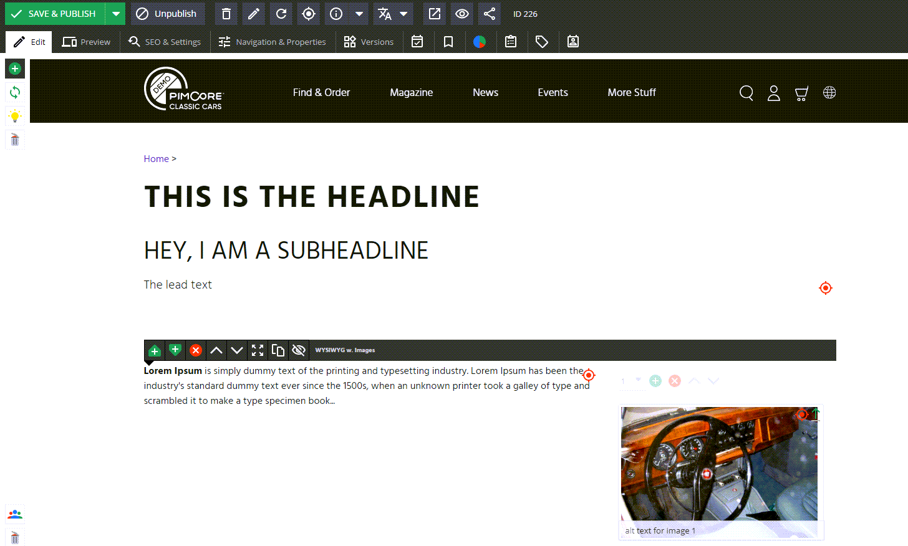
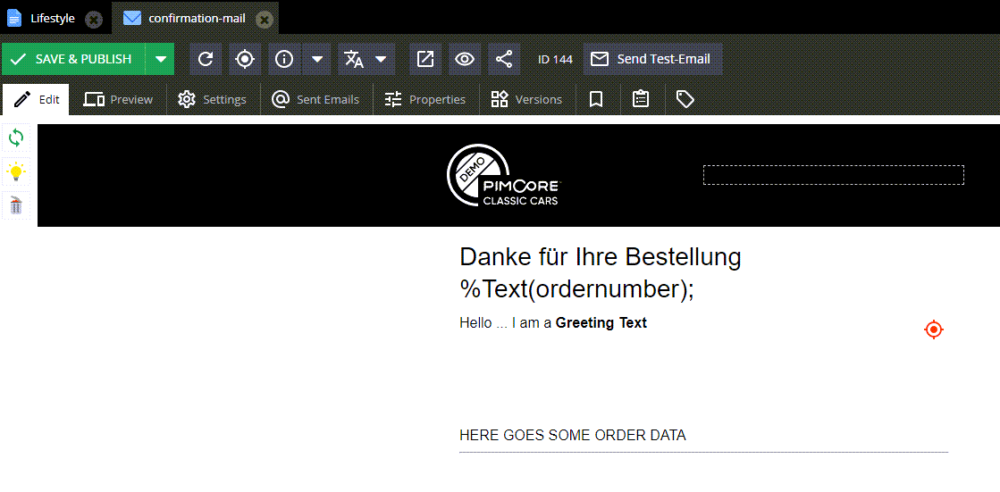

## Document Mutations

> Experimental + not feature complete! Subject to change without notice.
 
## Supported Document types

* Email
* Link
* Page
* ...

## Supported Page Element types

* Areablock
* Block
* Image (for now only target asset + alt text, no hotspots or markers)
* Input
* Multiselect
* Select
* Wysiwyg
* ...

## Free-form API

> Important Note: To be able to fully exploit this feature you have to understand Pimcore's [editable naming strategy](https://pimcore.com/docs/6.x/Development_Documentation/Documents/Editable_Naming_Strategies.html) 

### Sample 1 (Update existing document)


```graphql
mutation {
  updateDocumentPage(id: 99, input: {
    
    editables: {input: [
      {_tagName: "content:2.headline"
      text:"HEYYOU 3"},
      {_tagName: "headline"
      text:"NEW 2"}
    ],
      wysiwyg: [
        {_tagName:"content:1.content",
        text:"my new <b>wysiwyg</b>"}
        
      ]
    
    }
    module: "mymodule"}) {
    success
    document {
      controller
    }
  }
}
```

### Sample 2 (Create document with areablocks and nested block with images)

See demo document 99 for reference.

```graphql
mutation {
	createDocumentPage(
		key: "documentkey47"	
		parentId: 1
		input: {
			editables: {
				areablock: [
					{
						_tagName: "content"
						indices: [
							{ key: "1", type: "headlines", hidden: false }
							{
								key: "2"
								type: "wysiwyg-with-images"
								hidden: false
							}
							{ key: "3", type: "image", hidden: false }
						]
					}
				]
				block: { _tagName: "content:2.images", indices: [1, 2] }
				image: [
					{ _tagName: "content:3.image", alt: "alt text", id: 67 }
					{
						_tagName: "content:2.images:1.image"
						alt: "alt text for image 1"
						id: 18
					}
					{
						_tagName: "content:2.images:2.image"
						alt: "alt text for image 2"
						id: 22
					}
				]
				input: [
					{
						_tagName: "content:1.headline"
						text: "HEY, I AM A SUBHEADLINE"
					}
					{ _tagName: "headline", text: "THIS IS THE HEADLINE" }
				]
				wysiwyg: [
					{ _tagName: "content:1.lead", text: "The lead text" }
					{
						_tagName: "content:2.content"
						text: "<b>Lorem Ipsum</b> is simply dummy text of the printing and typesetting industry. Lorem Ipsum has been the industry's standard dummy text ever since the 1500s, when an unknown printer took a galley of type and scrambled it to make a type specimen book..."
					}
				]
			}
			controller: "@AppBundle\\Controller\\ContentController"
			action: "default"
		}
	) {
		success
		document {
			controller
			elements {
				__typename
			}
		}
	}
}
```



### Sample 3 (Update email document)

See demo document 144 for reference.

```graphql
mutation {
	updateDocumentEmail(
		id: 144
		input: {
			editables: {
				wysiwyg: [
					{
						_tagName: "greeting_text"
						text: "Hello ... I am a <b>Greeting Text</b>"
					}
				]
			}
			subject: "Email subject"
		}
	) {
		success
		document {
			controller
		}
	}
}
```



### Sample 4 (Create a new link document)

```graphql
mutation {
  createDocumentLink(key: "newlinkdocument", parentId:1, input: {
    internal:308
    internalType:"asset"         
    }    
  
  ) {
    success
  }
}
```


## Tree API

If you are not familiar with Pimcore's [editable naming strategy](https://pimcore.com/docs/6.x/Development_Documentation/Documents/Editable_Naming_Strategies.html)
you can also use the nested approach.

### Sample 4 (Update a page with an areablock using the nested approach)

```graphql
mutation {
	updateDocumentPage(
		id: 99
		input: {
			editables: {
				areablock: [
					{
						_tagName: "content"
						items: [
							{
								type: "headlines"
								editables: {
									input: [
										{
											_tagName: "headline"
											text: "HEY, I AM A SUBHEADLINE"
										}
									]
								}
							}
						]
					}
				]
			}
			controller: "@AppBundle\\Controller\\ContentController"
			action: "default"
		}
	) {
		success
		document {
			controller
			elements {
				__typename
			}
		}
	}
}
```

### Sample 5 (Create document with areablocks and nested block with images)

Note that this produces the same result as `Sample 2`but uses the nested API instead
of the free-form approach

```graphql
mutation {
	createDocumentPage(
		key: "documentkey48"
		parentId: 1
		input: {
			editables: {
				areablock: [
					{
						_tagName: "content"
						items: [
							{
								type: "headlines"
								hidden: false # optional
								replace: false # defaults to true, all editables will be replaced (of course, this only makes sense for updates)
								editables: {
									input: [
										{
											_tagName: "headline"
											text: "HEY, I AM A SUBHEADLINE"
										}
									]
									wysiwyg: [
										{
											_tagName: "lead"
											text: "The lead text"
										}
									]
								}
							}
							{
								type: "wysiwyg-with-images"
								replace: false
								editables: {
									block: [
										{
											_tagName: "images"
											items: [
												{
													replace: false # replace all elements inside the editable
													editables: {
														image: [
															{
																_tagName: "image"
																alt: "alt text for image 1"
																id: 18
															}
														]
													}
												}
												{
													replace: true
													editables: {
														image: [
															{
																_tagName: "image"
																alt: "alt text for image 2"
																id: 22
															}
														]
													}
												}
											]
										}
									]
									wysiwyg: [
										{
											_tagName: "content"
											text: "<b>Lorem Ipsum</b> is simply dummy text of the printing and typesetting industry. Lorem Ipsum has been the industry's standard dummy text ever since the 1500s, when an unknown printer took a galley of type and scrambled it to make a type specimen book..."
										}
									]
								}
							}
							{
								type: "image"
								editables: {
									image: [
										{
											_tagName: "image"
											alt: "alt text"
											id: 67
										}
									]
								}
							}
						]
					}
				]
				input: [{ _tagName: "headline", text: "THIS IS THE HEADLINE" }]
			}
			controller: "@AppBundle\\Controller\\ContentController"
			action: "default"
		}
	) {
		success
		document {
			controller
			elements {
				__typename
			}
		}
	}
}
```  